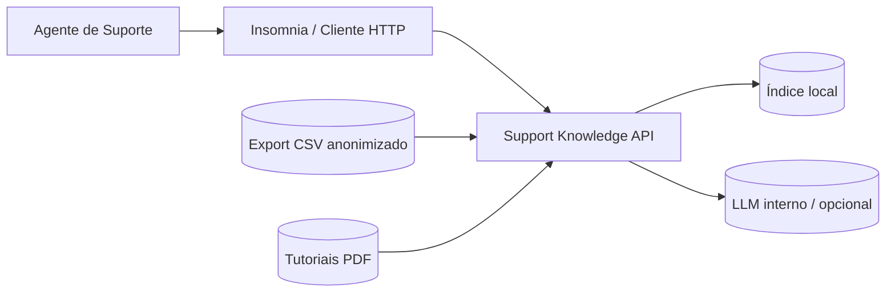
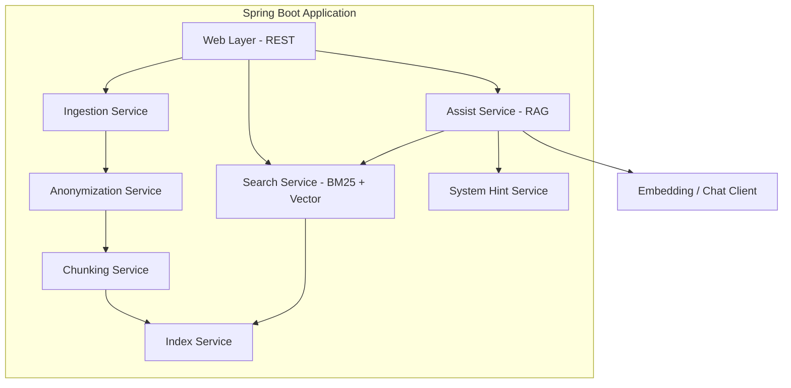
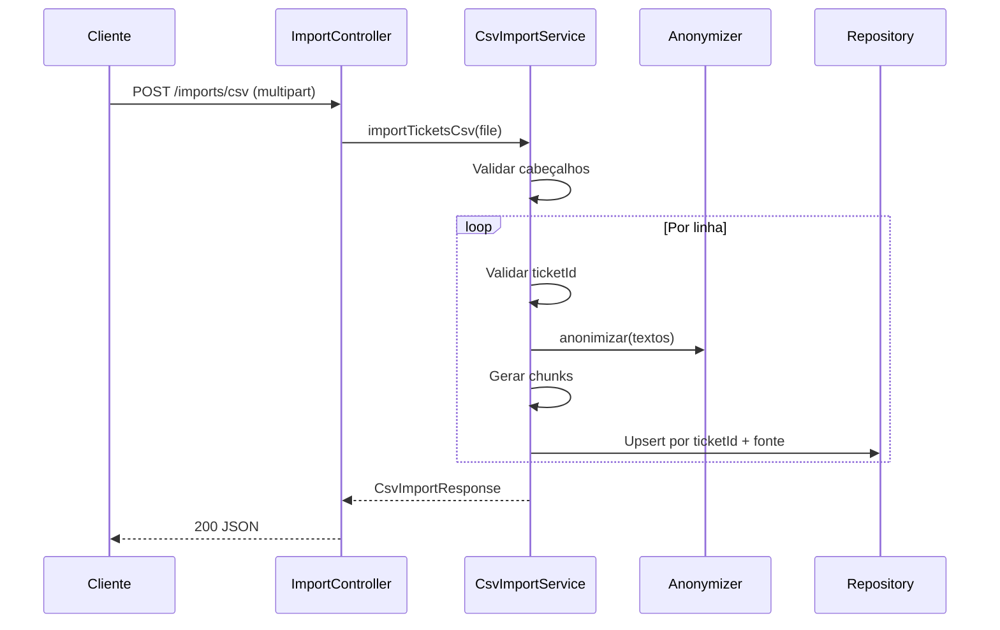
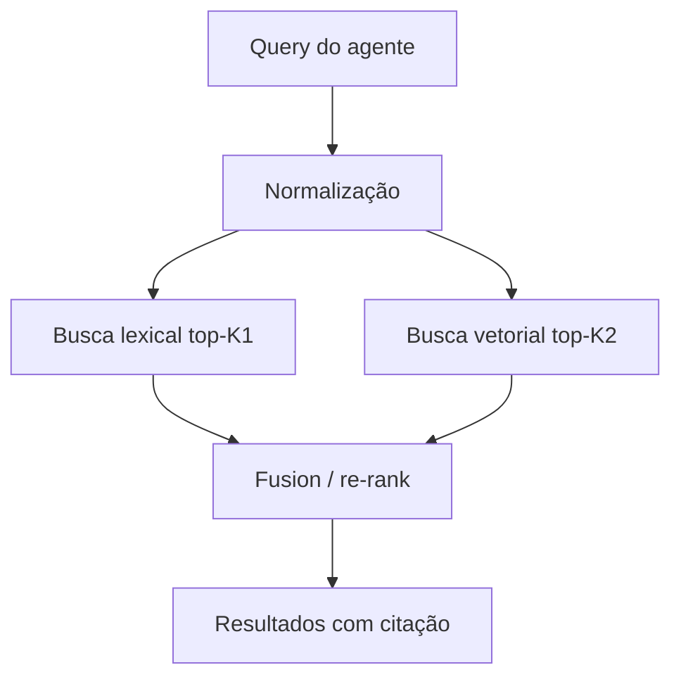
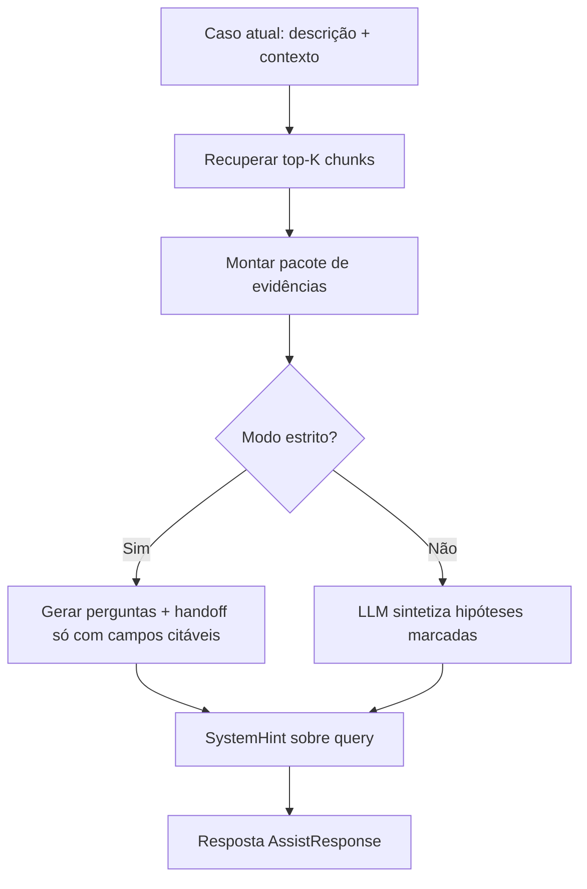

# SDD — Support Knowledge API

**Software Design Document**

| Campo | Valor |
|-------|--------|
| **Projeto** | support-knowledge-api |
| **Versão do documento** | 1.0 |
| **Data** | 16/05/2026 |
| **Status** | MVP em elaboração |
| **Stack** | Java 21, Spring Boot 3.3, Maven |
| **Cliente principal** | Insomnia / OpenAPI (sem UI no MVP) | 

---

## 1. Sumário executivo

O **Support Knowledge API** é uma API local (Spring Boot) que ingere histórico de atendimentos exportado em **CSV** e tutoriais em **PDF**, indexa o conteúdo textual e permite **busca híbrida** (palavra-chave + semântica) e **assistência com RAG** (Retrieval-Augmented Generation), sempre priorizando **evidências citáveis** sobre inferências.

O problema de negócio: agentes de suporte do Ministério Público atendem ~17 sistemas; o sistema oficial de chamados guarda histórico, mas a **busca é ineficiente**, levando a consultas a colegas ou desenvolvedores e aumentando o tempo até um **primeiro caminho plausível** de solução.

O MVP é **API-only**, executado inicialmente em **máquina pessoal** com dados **anonimizados**, evoluindo depois para ambiente corporativo.

---

## 2. Contexto

### 2.1 Cenário operacional

- Equipe de suporte recebe requisições em um sistema de gerenciamento de chamados.
- Cada chamado possui: descrição do usuário, log público, log privado e solução final.
- Existe **identificador único** por chamado; histórico em **colunas separadas** (não em linhas múltiplas).
- **Não há coluna** que identifique qual dos ~17 sistemas está envolvido — o sistema deve ser **inferido** do texto ou **declarado** pelo agente na consulta.
- Exportação do CSV é **manual** (sem integração automática no MVP).
- Tutoriais existem em **PDF com texto selecionável**.
- Encaminhamento para desenvolvimento segue template ideal: **Sistema > Local > Erro > Pedido**; o que mais falta costuma ser **imagem/vídeo** demonstrativo.

### 2.2 Usuários

| Persona                           | Uso da API                                                          |
|-----------------------------------|---------------------------------------------------------------------|
| Agente de suporte                 | Importa CSV/PDF, consulta `/search` e `/assist` durante atendimento |
| Desenvolvedor do produto (futuro) | Consome rascunhos de handoff gerados                                |
| Mantenedor (você)                 | Reindexa, ajusta dicionário de sistemas, regras de anonimização     |

### 2.3 Objetivo de produto (MVP)

Reduzir o tempo até encontrar um **caminho plausível** para investigação/solução, mesmo que esse caminho não seja a resposta final — incluindo sugestão de **perguntas ao usuário** (ex.: solicitar prints) com base em padrões históricos.

### 2.4 Objetivo de portfólio

Demonstrar arquitetura de ingestão, indexação, busca híbrida, RAG com **citações**, governança de dados sensíveis e API documentada (OpenAPI).

---

## 3. Escopo

### 3.1 Dentro do escopo (MVP)

| ID    | Capacidade |
|-------|------------|
| IN-01 | Importação de CSV configurável (cabeçalhos, delimitador `,` ou `;`) |
| IN-02 | Importação de PDFs (texto extraído via PDFBox) |
| IN-03 | Anonimização configurável antes da persistência/indexação |
| IN-04 | Persistência local de chunks indexáveis |
| IN-05 | Reindexação idempotente por `importBatchId` |
| IN-06 | Busca híbrida (BM25 + embeddings) com filtros opcionais |
| IN-07 | Endpoint `/assist` com separação evidência / inferência / perguntas / handoff |
| IN-08 | Sugestão heurística de sistema (YAML de dicionário) |
| IN-09 | Health, OpenAPI/Swagger, erros em Problem Details (RFC 7807) |

### 3.2 Fora do escopo (MVP)

- Interface web ou desktop
- Integração automática com o sistema oficial de chamados
- SSO, RBAC corporativo, auditoria formal
- Classificador ML supervisionado de sistema
- OCR em PDF (texto já é selecionável)
- Workflow de abertura/fechamento de chamados
- Push para fila de desenvolvimento

### 3.3 Evolução pós-MVP (referência)

- UI mínima; agendamento de reimport; métricas de uso; fine-tuning de classificador; deploy corporativo; API key / rede interna.

---

## 4. Requisitos

### 4.1 Requisitos funcionais

| ID | Requisito | Prioridade |
|----|-----------|------------|
| RF-01 | A API deve aceitar upload de CSV e validar cabeçalhos obrigatórios configuráveis | P0 |
| RF-02 | Cada linha válida deve gerar chunks vinculados a `ticketId` e `importBatchId` | P0 |
| RF-03 | A API deve aceitar upload de um ou mais PDFs e extrair texto por página | P1 |
| RF-04 | Texto importado deve passar por pipeline de anonimização (com preview) | P0 |
| RF-05 | Reimportação do mesmo lote não deve duplicar chunks semanticamente | P1 |
| RF-06 | Busca deve retornar top-K trechos com score, snippet e citação | P0 |
| RF-07 | Assistência deve listar evidências recuperadas antes de qualquer síntese | P0 |
| RF-08 | Modo estrito: soluções finais só a partir de citações; hipóteses opcionais | P1 |
| RF-09 | Handoff deve seguir estrutura Sistema > Local > Erro > Pedido com origem do campo | P1 |
| RF-10 | Deve sugerir perguntas ao usuário (incl. mídia) com base em padrões | P1 |
| RF-11 | Consulta pode receber `sistemaDeclarado` para boost de relevância | P2 |
| RF-12 | Endpoint deve expor cabeçalhos CSV esperados para conferência no Insomnia | P0 |

### 4.2 Requisitos não funcionais

| ID | Requisito | Meta (MVP) |
|----|-----------|------------|
| RNF-01 | Execução local Windows, JDK 21 | Obrigatório |
| RNF-02 | Import CSV até ~80 MB (configurável) | Conforme `application.yml` |
| RNF-03 | Latência de busca (índice quente, K≤10) | < 3 s em máquina pessoal típica |
| RNF-04 | Rastreabilidade: toda resposta de assistência cita fonte | Obrigatório |
| RNF-05 | Dados sensíveis não persistidos sem anonimização | Obrigatório |
| RNF-06 | API documentada via OpenAPI 3 | Obrigatório |
| RNF-07 | Testes automatizados para ingestão e busca | Cobertura mínima nos fluxos críticos |
| RNF-08 | LLM apenas em ambiente permitido (interno / local) | Configurável por perfil |

### 4.3 Métricas de sucesso (validação manual)

| Métrica | Como medir |
|---------|------------|
| Tempo até primeiro caminho útil | Cronômetro: abertura do caso → primeira evidência relevante |
| Dependência de colega/dev | Checklist sim/não por atendimento (amostra 2 semanas) |
| Qualidade do handoff | % de pacotes aceitos pelos devs sem pedido de complemento |

Colunas opcionais no CSV (`dataInicio`, `dataFim`) habilitam análise posterior; não bloqueiam o MVP.

---

## 5. Arquitetura

### 5.1 Visão de contexto (C4 — nível 1)



### 5.2 Visão de containers (C4 — nível 2)



### 5.3 Camadas lógicas (pacotes Java)

```
com.mpsupport.knowledge
├── config          # Properties, beans
├── controller      # REST, validação de entrada
├── dto             # Records de request/response
├── domain          # Entidades: Chunk, Ticket, ImportBatch, Fonte
├── repository      # Persistência (JPA/JDBC)
├── service
│   ├── ingest      # CSV, PDF
│   ├── anonymize
│   ├── chunk
│   ├── index
│   ├── search
│   ├── assist
│   └── systemhint
└── integration     # LLM, embedding (Spring AI / LangChain4j)
```

### 5.4 Decisões arquiteturais (resumo)

| Decisão | Escolha | Motivo |
|---------|---------|--------|
| Persistência MVP | SQLite ou H2 em arquivo | Simples, local, portfólio |
| Busca | Híbrida BM25 + vetorial | Logs misturam termos exatos e linguagem livre |
| RAG | Retrieve-then-generate com citações obrigatórias | Reduz alucinação em suporte |
| Sistema | Heurística YAML + `sistemaDeclarado` opcional | Sem coluna no CSV |
| Integração LLM | Abstração via interface | Trocar provedor sem reescrever domínio |
| API | REST JSON + multipart | Alinhado ao Insomnia |

---

## 6. Modelo de dados

### 6.1 Entidades principais

#### `import_batch`

| Campo | Tipo | Descrição |
|-------|------|-----------|
| id | UUID | PK |
| tipo | ENUM | `CSV`, `PDF` |
| arquivo_nome | VARCHAR | Nome original |
| criado_em | TIMESTAMP | |
| status | ENUM | `PROCESSING`, `DONE`, `FAILED` |
| linhas_processadas | INT | |
| chunks_criados | INT | |

#### `knowledge_chunk`

| Campo | Tipo | Descrição |
|-------|------|-----------|
| id | UUID | PK |
| import_batch_id | UUID | FK |
| ticket_id | VARCHAR | Nullable (PDF não tem) |
| fonte | ENUM | `HISTORICO_DESCRICAO`, `HISTORICO_LOG_PUBLICO`, `HISTORICO_LOG_PRIVADO`, `HISTORICO_SOLUCAO`, `TUTORIAL_PDF` |
| texto | TEXT | Conteúdo anonimizado |
| texto_busca | TEXT | Normalizado (lowercase, sem acento opcional) |
| arquivo_pdf | VARCHAR | Nullable |
| pagina_inicio | INT | Nullable |
| pagina_fim | INT | Nullable |
| chunk_index | INT | Ordem dentro do documento |
| sistema_sugerido | VARCHAR | Nullable |
| confianca_sistema | DECIMAL | Nullable |
| criado_em | TIMESTAMP | |

#### `chunk_embedding` (fase B)

| Campo | Tipo | Descrição |
|-------|------|-----------|
| chunk_id | UUID | FK |
| modelo | VARCHAR | ex. `text-embedding-3-small` |
| vetor | BLOB / tabela vetorial | Implementação depende do store |

### 6.2 Documento lógico por chamado (ingestão CSV)

Para cada linha com `ticketId` válido, até **quatro chunks** independentes:

1. Descrição do usuário  
2. Log público  
3. Log privado  
4. Solução final  

Campos vazios não geram chunk.

### 6.3 Chunking de PDF

- Extrair texto por página (PDFBox).
- Normalizar quebras de linha.
- Dividir em chunks de **~500–800 tokens** (ou ~2000 caracteres) com **sobreposição ~10–15%** para não cortar procedimentos no meio.
- Metadados: `arquivo`, `pagina_inicio`, `pagina_fim`, `chunk_index`.

### 6.4 Índice de busca

| Índice | Tecnologia (proposta MVP) | Uso |
|--------|---------------------------|-----|
| Lexical | Apache Lucene embutido ou SQL FTS | BM25 / full-text |
| Vetorial | Tabela + similaridade cosseno ou biblioteca local | Semântica |

---

## 7. Fluxos principais

### 7.1 Importação de CSV



**Regras:**

- Linha totalmente vazia → `skippedRows++`
- Linha com texto mas sem `ticketId` → erro `TICKET_ID_MISSING`, não persiste
- Mesmo `ticketId` + mesma `fonte` em novo batch → substituir chunks anteriores daquela fonte (idempotência)

### 7.2 Busca híbrida



**Fusão sugerida:** Reciprocal Rank Fusion (RRF) ou média ponderada (peso configurável). Filtros opcionais: `fonte`, intervalo de datas (se existir no modelo futuro), `sistemaDeclarado`.

### 7.3 Assistência (RAG)



**Contrato de confiança:**

- `evidencias[]`: sempre com `ticketId` ou `pdf`+página e `snippet`
- `hipoteses[]`: vazio no modo `CITADO_OBRIGATORIO_PARA_SOLUCOES`
- `perguntasAoUsuario[]`: inclui checklist de mídia quando padrão histórico indicar
- `rascunhoHandoff`: cada campo com `origem`: `citacao` | `inferencia` | `heuristica_sistema`

---

## 8. API REST

**Base URL:** `http://localhost:8080/api/v1`

### 8.1 Endpoints — Épico A (Ingestão)

| Método | Path | Descrição | Status |
|--------|------|-----------|--------|
| GET | `/imports/csv/expected-headers` | Cabeçalhos e delimitador esperados | Implementado |
| POST | `/imports/csv` | Upload CSV (`file`) | Parcial (valida/conta; persistência pendente) |
| POST | `/imports/pdfs` | Upload PDF(s) | Planejado |
| POST | `/anonymize/preview` | Preview de anonimização | Planejado |
| GET | `/index/status` | Contagem chunks / último batch | Planejado |

#### POST `/imports/csv` — Resposta

```json
{
  "importBatchId": "uuid",
  "processedRows": 1240,
  "skippedRows": 3,
  "chunksCreated": 9802,
  "errors": [
    { "rowNumber": 88, "code": "TICKET_ID_MISSING", "message": "..." }
  ]
}
```

### 8.2 Endpoints — Épico B (Busca e assistência)

| Método | Path | Descrição |
|--------|------|-----------|
| POST | `/search` | Busca híbrida | Implementado |
| POST | `/assist` | RAG + handoff + perguntas | Implementado |

#### POST `/search` — Request

```json
{
  "query": "Não consigo anexar documento, erro ao gravar",
  "topK": 8,
  "filters": {
    "fonte": "historico",
    "sistemaDeclarado": null,
    "dateFrom": null,
    "dateTo": null
  }
}
```

#### POST `/assist` — Request

```json
{
  "casoAtual": {
    "descricaoUsuario": "...",
    "contextoAdicional": "...",
    "sistemaDeclarado": null
  },
  "topK": 10,
  "modo": "CITADO_OBRIGATORIO_PARA_SOLUCOES"
}
```

**Enum `modo`:**

- `CITADO_OBRIGATORIO_PARA_SOLUCOES` — sem hipóteses livres
- `PERMITIR_HIPOTESES` — hipóteses claramente rotuladas

### 8.3 Endpoints — Épico C (Operação)

| Método | Path | Descrição |
|--------|------|-----------|
| GET | `/actuator/health` | Saúde da aplicação |
| GET | `/api/v1/docs/swagger-ui` | Documentação interativa |
| GET | `/api/v1/docs/openapi` | OpenAPI JSON |

### 8.4 Erros

Padrão **RFC 7807** (`ProblemDetail`):

- `400` — cabeçalho CSV ausente, arquivo vazio
- `413` — arquivo acima do limite multipart
- `500` — falha de leitura/processamento

---

## 9. Anonimização

### 9.1 Momento de aplicação

**Sempre antes** de persistir ou indexar. Endpoint de preview não persiste.

### 9.2 Regras (configuráveis em `anonymization-rules.yml`)

| Tipo | Exemplo de padrão | Substituição |
|------|-------------------|--------------|
| CPF | `\d{3}\.\d{3}\.\d{3}-\d{2}` | `[CPF_REMOVIDO]` |
| E-mail | RFC simplificado | `[EMAIL_REMOVIDO]` |
| Telefone | DDD + número | `[TELEFONE_REMOVIDO]` |
| Nome próprio | Lista opcional / NER futuro | `[NOME_REMOVIDO]` |

### 9.3 Responsabilidade do operador

Mesmo com regras automáticas, o export deve ser **revisado** antes de sair do ambiente corporativo para a máquina pessoal, conforme política interna.

---

## 10. Heurística de sistema (sem coluna no CSV)

### 10.1 Arquivo `systems-hints.yml`

```yaml
systems:
  - id: "SISTEMA_EXEMPLO"
    displayName: "Nome amigável"
    aliases: ["SIGLA", "Nome longo"]
    keywords:
      - "anexo"
      - "validação"
    negativeKeywords:
      - "termo que gera falso positivo"
    weight: 1.0
```

### 10.2 Algoritmo de scoring

Para um texto `T` e sistema `S`:

```
score(S, T) = weight(S) * (
  sum(peso_keyword * match(keyword, T)) 
  - sum(penalidade * match(negativeKeyword, T))
)
```

Normalizar scores para `[0, 1]` entre os 17 sistemas. Retornar top 3 se empate ou confiança < limiar (ex. 0.35).

### 10.3 Uso na busca

- Se `sistemaDeclarado` presente na request → boost ×1.5 em chunks com `sistema_sugerido` compatível (configurável).
- Nunca ocultar resultados de outros sistemas no MVP (apenas reordenar).

---

## 11. Integração com LLM

### 11.1 Componentes

| Componente | Função |
|----------|--------|
| Embedding client | Gerar vetores dos chunks na ingestão e da query |
| Chat client | Sintetizar perguntas e handoff a partir das evidências |

### 11.2 Prompt de sistema (diretrizes)

- Responder **apenas** com base nas evidências fornecidas.
- Se faltar informação, listar em `perguntasAoUsuario`.
- Nunca inventar número de chamado ou solução não presente nos trechos.
- Formato de saída: JSON estruturado mapeado para `AssistResponse`.

### 11.3 Configuração (`application.yml` — futuro)

```yaml
app:
  llm:
    provider: INTERNAL # ou OPENAI_COMPATIBLE
    base-url: ${LLM_BASE_URL}
    api-key: ${LLM_API_KEY}
    embedding-model: ...
    chat-model: ...
```

---

## 12. Segurança e privacidade

| Tópico | MVP |
|--------|-----|
| Autenticação | Nenhuma (localhost) |
| Transporte | HTTP local; HTTPS em deploy futuro |
| Dados em repouso | Arquivo SQLite no disco pessoal; diretório configurável |
| Segredos | Variáveis de ambiente, não commitadas |
| Logs da API | Não logar corpo completo de chamados em INFO |
| Retenção | Operador pode apagar pasta de dados e reindexar |

---

## 13. Plano de entrega (épicos)

A ordem abaixo é a **sequência de implementação recomendada**, não apenas agrupamento temático.

| Fase | Épico | Entregas | Dependências |
|------|-------|----------|--------------|
| 0 | Bootstrap | Spring Boot, health, OpenAPI, import CSV validação | — |
| 1 | A1 + A4 | Persistência chunks + idempotência CSV | Fase 0 |
| 2 | A3 | Anonimização + preview | Fase 1 |
| 3 | A2 | Import PDF | Fase 1 |
| 4 | B1 | Busca BM25 (sem vetor) | Fase 1 |
| 5 | B1+ | Embeddings + busca híbrida | Fase 4 + LLM config |
| 6 | B3 | System hints YAML | Fase 4 |
| 7 | B2 | `/assist` RAG | Fase 5, 6 |
| 8 | C | Métricas index, reload YAML | Fase 7 |

### 13.1 Estado atual (baseline)

| Item | Status |
|------|--------|
| Projeto Maven Spring Boot 3.3 | Feito |
| `POST /imports/csv` (validação + contagem) | Feito |
| `GET /imports/csv/expected-headers` | Feito |
| Persistência / índice / busca / RAG | Não iniciado |

---

## 14. Estratégia de testes

| Nível | Escopo |
|-------|--------|
| Unitário | Anonimização, chunking, scoring de sistema, parse CSV (`;` e `,`) |
| Integração | Import CSV → banco → busca retorna chunk conhecido |
| Contrato | OpenAPI gerado vs Insomnia collection exportada |
| Manual | Amostra anonimizada: comparar tempo com busca oficial |

**Casos críticos:**

- CSV sem coluna obrigatória → 400 com mensagem clara
- Linha sem ID com texto → erro na lista, não aborta lote inteiro
- Reimport mesmo ticket → chunks atualizados, contagem estável
- Modo estrito → `hipoteses` vazio quando não há citação

---

## 15. Configuração e operação

### 15.1 Variáveis principais (`application.yml`)

| Chave | Descrição |
|-------|-----------|
| `app.import.csv.delimiter` | `COMMA` ou `SEMICOLON` |
| `app.import.csv.*-header` | Nomes exatos das colunas |
| `app.storage.path` | Diretório de SQLite e índice (planejado) |
| `spring.servlet.multipart.max-file-size` | Limite upload |

### 15.2 Fluxo operacional do agente

1. Exportar CSV do sistema oficial.
2. Anonimizar (script externo ou `/anonymize/preview` + export limpo).
3. `POST /imports/csv`.
4. Importar PDFs da pasta de tutoriais quando necessário.
5. Durante atendimento: `POST /assist` com descrição do caso.
6. Periodicamente: novo export → reimport (substitui índice por ticket).

---

## 16. Riscos e mitigações

| Risco | Impacto | Mitigação |
|-------|---------|-----------|
| Cabeçalhos CSV diferentes do configurado | Import falha | `expected-headers` + doc clara |
| Falso positivo de sistema | Busca enviesada | `sistemaDeclarado` + exibir confiança |
| Alucinação do LLM | Solução errada | Modo estrito + citações obrigatórias |
| CSV muito grande | Lentidão | Import assíncrono (pós-MVP), batch |
| Dados pessoais no índice | Compliance | Anonimização + revisão humana |
| Embeddings custosos | Tempo de import | Job em background; cache por hash de texto |

---

## 17. Glossário

| Termo | Definição |
|-------|-----------|
| **Chunk** | Trecho indexável de texto com metadados |
| **RAG** | Recuperar documentos relevantes antes de gerar resposta |
| **BM25** | Algoritmo de ranking lexical |
| **Handoff** | Pacote de informações enviado à equipe de desenvolvimento |
| **Modo estrito** | Respostas de solução apenas com evidência recuperada |
| **importBatchId** | Identificador de uma execução de importação |

---

## 18. Referências

- Spring Boot 3.3 — https://spring.io/projects/spring-boot  
- Springdoc OpenAPI — https://springdoc.org  
- Apache Commons CSV — https://commons.apache.org/proper/commons-csv/  
- Apache PDFBox — https://pdfbox.apache.org/  
- RFC 7807 Problem Details — https://datatracker.ietf.org/doc/html/rfc7807  

---

## 19. Aprovações e revisões

| Versão | Data | Autor | Alterações |
|--------|------|-------|--------------|
| 1.0 | 16/05/2026 | — | Versão inicial do SDD MVP |

---

*Documento vivo: atualizar a seção 13.1 conforme cada fase for concluída.*
